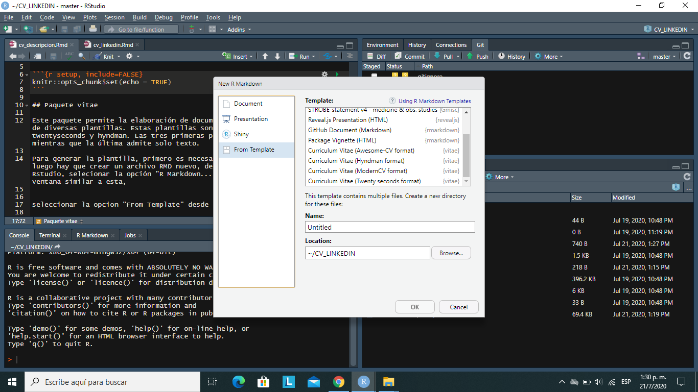

```{r setup, include=FALSE}
knitr::opts_chunk$set(echo = TRUE)
```

## \textcolor{blue}{Paquete vitae}

Este paquete permite la elaboración de documentos R Markdown mediante el uso de diversas plantillas, las cuales tienen el formato de un curriculum vitae. Estas plantillas son, moderncv, awesomecv, twentyseconds y hyndman. Las tres primeras permiten agregar una foto mientras que la última admite solo texto.

Para generar la plantilla, primero es necesario tener instalado el paquete "vitae", luego hay que crear un archivo RMD nuevo, desde la barra de herramientas de Rstudio y selecionar la opción "R Markdown...". Realizado esto aparecerá una ventana similar a esta,



se debe seleccionar la opción "From Template" desde el panel lateral izquierdo. Posteriormente es necesario elegir una opción del panel superior derecho, luego se le agrega un nombre y se especifica donde se guardará el archivo, finalmente se le da al boton "OK".

Una vez realizado esto, se generará una plantilla por defecto la cual podremos modificar, para ello hay que tener en cuenta lo siguiente,

* Las primeras líneas de código que están encerradas por "---" (tres guiones seguidos) se le conoce como encabezado y es ahí donde debemos colocar nuestro nombre, profesión, correo, foto (dependiendo de la plantilla), entre otros. Es importante considerar el argumento "output", el cual nos permite controlar que plantilla vamos a utilizar, sus opciones son,

  - vitae::moderncv
  - vitae::awesomecv
  - vitae::twentyseconds
  - vitae::hyndman

cada una cuenta con un formato diferente, pero basicamente muestra la misma información.

* Para crear una sección se utiliza el símbolo "#", el cual genera un título que describe la sección creada. Es posible crear subtitulos agregando uno o dos "#", de la siguente manera "##" ó "###".

* Para crear un ítem se usa el "*" ó el "+" el cual me permite listar información importante.

* Para subrayar una palabra se usa el "*", el mismo deben envolver a la palabra.

* Para colocar una palabra en cursiva, se usa el "__", lo cuales son dos guiones bajos seguidos.

Con estos tips es posible crear diferentes secciones y destacar cosas importantes lo cual es muy útil al crear o actulizar nuestro CV.
Para mayor comodidad puede observar el archivo "cv_linkedin.Rmd" en mi dirección de Github, haciendo click [\textcolor{blue}{aquí}](https://github.com/Fr3ddy1/CV_RMD).

En la páginas siguientes se puede apreciar un curriculum genérico, usando las cuatro plantillas mencionadas. El orden es el siguiente, primero se encuentra la plantilla "moderncv", luego "awesomecv", después "hyndman" y finalmente "twentyseconds".


